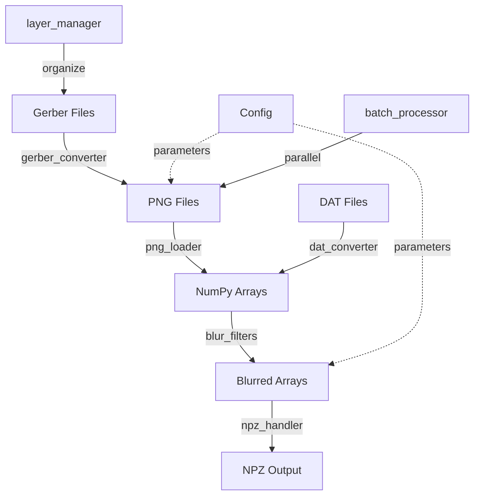

# Copper Balancing Image Processing - Project Plan

## Overview
This project provides a modular Python framework for processing PCB Gerber files, converting them to images, and applying various image processing operations including blur filters for copper balancing analysis.

## Project Structure

```
CopperBalancingFinal/
├── src/
│   ├── __init__.py
│   ├── main.py                          # Main entry point
│   └── config.py                        # Configuration management
│
├── lib/
│   ├── __init__.py
│   ├── conversion_operations/
│   │   ├── __init__.py
│   │   ├── dat_converter.py            # DAT file to array conversion
│   │   ├── gerber_converter.py         # Gerber to PNG using gerbv
│   │   ├── png_loader.py               # PNG to numpy array
│   │   └── npz_handler.py              # NPZ save/load operations
│   │
│   ├── array_operations/
│   │   ├── __init__.py
│   │   ├── blur_filters.py             # Box and Gaussian blur
│   │   ├── array_utils.py              # General array utilities
│   │   └── image_processing.py         # Additional image ops
│   │
│   └── gerber_operations/
│       ├── __init__.py
│       ├── gerber_parser.py            # Parse Gerber metadata
│       ├── layer_manager.py            # Handle layer stackups
│       └── batch_processor.py          # Batch process multiple files
│
├── tests/
│   ├── __init__.py
│   ├── test_conversion_operations/
│   │   ├── test_dat_converter.py
│   │   ├── test_gerber_converter.py
│   │   └── test_npz_handler.py
│   ├── test_array_operations/
│   │   ├── test_blur_filters.py
│   │   └── test_array_utils.py
│   └── test_gerber_operations/
│       ├── test_layer_manager.py
│       └── test_batch_processor.py
│
├── examples/
│   ├── basic_blur_example.py
│   ├── batch_gerber_processing.py
│   └── custom_pipeline_example.py
│
├── docs/
│   ├── API.md
│   ├── USAGE.md
│   └── ALGORITHMS.md
│
├── Assets/                              # Existing assets
│   ├── gerbers/                         # Input Gerber files
│   ├── gerbv/                           # gerbv.exe tool
│   └── processed_pngs/                  # Existing processed data
│
├── output/                              # Generated outputs
│   ├── pngs/
│   ├── arrays/
│   └── processed/
│
├── requirements.txt
├── setup.py
├── README.md
└── PROJECT_PLAN.md                      # This file
```

## Library Modules

### 1. conversion_operations

Handles all file format conversions and I/O operations.

#### dat_converter.py
```python
def load_dat_file(filepath: str) -> np.ndarray
def dat_to_array(dat_data: bytes, shape: tuple) -> np.ndarray
def validate_dat_format(filepath: str) -> bool
```

#### gerber_converter.py
```python
def gerber_to_png(gerber_path: str, output_path: str, dpi: int = 300) -> str
def batch_gerber_to_png(gerber_dir: str, output_dir: str, dpi: int = 300) -> list
def get_gerbv_path() -> str
```

#### png_loader.py
```python
def load_png(filepath: str, grayscale: bool = True) -> np.ndarray
def png_to_array(filepath: str, normalize: bool = False) -> np.ndarray
def validate_png(filepath: str) -> bool
```

#### npz_handler.py
```python
def save_npz(filepath: str, arrays: dict, compressed: bool = True) -> None
def load_npz(filepath: str) -> dict
def save_array_stack(filepath: str, arrays: list, metadata: dict = None) -> None
def load_array_stack(filepath: str) -> tuple
```

### 2. array_operations

Core image processing and array manipulation operations.

#### blur_filters.py
```python
def box_blur(array: np.ndarray, kernel_size: int) -> np.ndarray
def gaussian_blur(array: np.ndarray, kernel_size: int, sigma: float = None) -> np.ndarray
def separable_blur(array: np.ndarray, kernel_1d: np.ndarray) -> np.ndarray
def create_gaussian_kernel(kernel_size: int, sigma: float) -> np.ndarray
def create_box_kernel(kernel_size: int) -> np.ndarray
```

**Box Blur Algorithm:**
- Simple averaging filter with uniform weights
- Kernel: all weights equal to 1/kernel_size²
- Separable: can be applied as two 1D passes for efficiency
- Time complexity: O(n) with separable implementation
- Use case: Fast smoothing, noise reduction

**Gaussian Blur Algorithm:**
- Weighted averaging using Gaussian distribution
- Kernel weights follow bell curve: exp(-(x² + y²)/(2σ²))
- Separable: 2D Gaussian = product of two 1D Gaussians
- Sigma (σ) controls blur strength
- Time complexity: O(n) with separable implementation
- Use case: Natural smoothing, edge preservation

#### array_utils.py
```python
def normalize_array(array: np.ndarray, min_val: float = 0, max_val: float = 1) -> np.ndarray
def pad_array(array: np.ndarray, padding: int, mode: str = 'reflect') -> np.ndarray
def crop_array(array: np.ndarray, bounds: tuple) -> np.ndarray
def validate_array(array: np.ndarray, expected_shape: tuple = None) -> bool
def convert_dtype(array: np.ndarray, target_dtype: np.dtype) -> np.ndarray
```

#### image_processing.py
```python
def threshold(array: np.ndarray, threshold_value: float) -> np.ndarray
def apply_mask(array: np.ndarray, mask: np.ndarray) -> np.ndarray
def calculate_statistics(array: np.ndarray) -> dict
```

### 3. gerber_operations

Gerber-specific functionality for PCB layer management.

#### gerber_parser.py
```python
def parse_gerber_header(filepath: str) -> dict
def extract_layer_info(filepath: str) -> dict
def get_layer_type(filename: str) -> str
def parse_layer_name(filename: str) -> tuple
```

#### layer_manager.py
```python
def organize_layers(gerber_dir: str) -> dict
def get_layer_stack(quadrant: str, gerber_dir: str) -> list
def validate_layer_stack(layers: list) -> bool
def get_quadrant_layers(base_dir: str) -> dict
```

#### batch_processor.py
```python
def process_directory(input_dir: str, output_dir: str, operations: list) -> dict
def process_layer_stack(layers: list, operations: list) -> list
def parallel_process(files: list, operation: callable, workers: int = 4) -> list
```

## Configuration System

### config.py
```python
class Config:
    # Paths
    GERBV_PATH: str = "Assets/gerbv/gerbv.exe"
    ASSETS_DIR: str = "Assets"
    OUTPUT_DIR: str = "output"
    
    # Processing parameters
    DEFAULT_DPI: int = 300
    DEFAULT_BLUR_KERNEL: int = 5
    DEFAULT_GAUSSIAN_SIGMA: float = 1.0
    
    # Layer naming
    LAYER_PATTERNS: dict = {
        'signal': r'l\d+_signal',
        'plane': r'l\d+_plane',
    }
    
    # Quadrants
    QUADRANTS: list = ['Q1', 'Q2', 'Q3', 'Q4', 'UL', 'UR', 'LL', 'LR']
```

## Workflow Diagram



## Processing Pipeline

### Basic Pipeline
1. Load Gerber files from Assets/gerbers/
2. Convert to PNG using gerbv.exe
3. Load PNG into numpy array
4. Apply blur filter (box or Gaussian)
5. Save processed array as NPZ

### Batch Pipeline
1. Organize layers by quadrant
2. Process each quadrant in parallel
3. Apply consistent blur parameters
4. Save results with metadata

## Dependencies

```
numpy>=1.24.0          # Array operations
scipy>=1.10.0          # Advanced filtering
Pillow>=10.0.0         # Image I/O
matplotlib>=3.7.0      # Visualization
pytest>=7.4.0          # Testing
pytest-cov>=4.1.0      # Coverage
```

## API Design Philosophy

- **Composable**: Each function does one thing well
- **Type-hinted**: All functions have type annotations
- **Documented**: Docstrings with examples
- **Testable**: Pure functions where possible
- **Efficient**: Vectorized numpy operations

## Example Usage

### Basic Blur Example
```python
from lib.conversion_operations import png_to_array
from lib.array_operations import box_blur, gaussian_blur
from lib.conversion_operations import save_npz

# Load image
array = png_to_array("Assets/processed_pngs/Q1_dpi_300/layer.png")

# Apply blurs
box_blurred = box_blur(array, kernel_size=5)
gauss_blurred = gaussian_blur(array, kernel_size=5, sigma=1.5)

# Save results
save_npz("output/blurred.npz", {
    'original': array,
    'box_blur': box_blurred,
    'gaussian_blur': gauss_blurred
})
```

### Batch Processing Example
```python
from lib.gerber_operations import batch_processor, layer_manager
from lib.array_operations import gaussian_blur

# Organize layers
layers = layer_manager.get_quadrant_layers("Assets/gerbers/Cu_Balancing_Gerber")

# Process Q1 layers
q1_layers = layers['Q1']
operations = [
    lambda arr: gaussian_blur(arr, kernel_size=5, sigma=1.5)
]

results = batch_processor.process_layer_stack(q1_layers, operations)
```

## Testing Strategy

### Unit Tests
- Test each function independently
- Mock external dependencies (file I/O, subprocess calls)
- Test edge cases and error handling

### Integration Tests
- Test complete pipelines
- Use sample data from Assets/
- Verify output format and quality

### Performance Tests
- Benchmark blur operations on large arrays
- Test parallel processing efficiency
- Memory usage profiling

## Next Steps

1. Implement core blur algorithms in array_operations
2. Create conversion utilities for existing code integration
3. Build configuration system
4. Implement batch processing
5. Add comprehensive tests
6. Create example scripts
7. Write API documentation

## Notes

- Existing NPZ files in Assets/processed_pngs/ show the project already has some processing done
- gerbv.exe is available in Assets/gerbv/
- Multiple quadrants (Q1-Q4) and regions (UL, UR, LL, LR) need to be handled
- DPI settings vary (50, 100, 200, 250, 300, 500, 700)